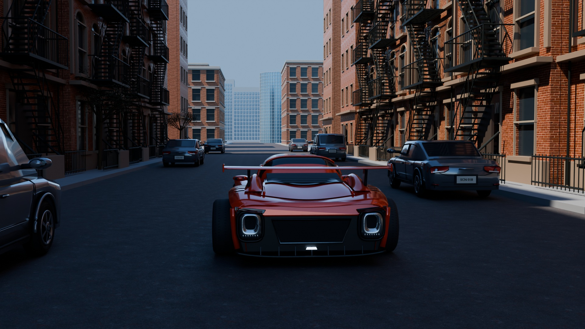

# Street scene

An original procedural Blender street scene with a red car and a five second camera move.
Attempt 23 is the selected final design.

**[Watch the final video](https://ridermw.github.io/street-scene-showcase/)**
| **[Concept art and references](https://ridermw.github.io/street-scene-showcase/concept.html)**
| **[Browse the attempts](https://ridermw.github.io/street-scene-showcase/attempts.html)**



The final video contains 120 frames at 1920 by 1080 and 24 fps.
The gallery includes 22 retained previews from attempts 1 through 23.
No preview was retained for attempt 4.
The concept page shows early scene studies and links to the external visual reference.
No separate drawn concept art was produced.

The selected design keeps the improved hero car and window design B.
It restores the earlier parked vehicle geometry.
The minivan shape and distant architecture remain below the reference target.
Selection of this design does not establish a reference quality match.

## Contents

| Path | Content |
|---|---|
| `docs/` | GitHub Pages site, final video, and attempt gallery |
| `blender/` | Geometry, scene construction, and capture scripts |
| `pipeline/` | Resource limits, ownership checks, and evidence records |
| `tools/` | Video encoding and review packet tools |
| `tests/` | Pipeline tests and Blender inspection scripts |
| `configs/street_scene.example.json` | Configuration example without machine paths |

This public export excludes private plans, review transcripts, machine paths,
raw run logs, and the downloaded reference video.
It does not include the private delivery archive.

## Run the tests

Use Python 3.11 or later, FFmpeg, and FFprobe.
Image preparation uses Pillow, listed in `requirements.txt`.

```sh
python3 -m unittest discover -s tests
```

## Build a new scene

The pipeline targets Blender 5.2.1 LTS on macOS with Metal.
The capture script does not support other GPU backends.
The public configuration is deliberately inactive.
Do not start a render until you set the intended time and storage limits.

1. Copy `configs/street_scene.example.json` to `configs/street_scene.json`.
2. Set `data_root`, a new `run_id`, and explicit UTC start and deadline values.
3. Set the storage and free space limits for your machine.
4. Download the CC0 `Bricks059` and `Asphalt012` JPG material sets from ambientCG.
5. Put each set's Color, Roughness, and Displacement JPGs in
   `DATA_ROOT/RUN_ID/assets/bricks` and `DATA_ROOT/RUN_ID/assets/asphalt`.
6. Run construction through the resource supervisor.

```sh
python3 -m pipeline.job --log build-attempt-01.log -- \
  /Applications/Blender.app/Contents/MacOS/Blender \
  -b --factory-startup --python-exit-code 1 \
  -P blender/build_scene.py -- --attempt attempt-01
```

The supervisor permits one heavy job at a time and reserves the last five minutes.
It writes job logs inside the configured run directory, not the repository root.
Use only isolated Blender processes. Do not run construction inside an unrelated open scene.
Full sequence capture also requires current design approval and a capacity forecast.
The source preserves those controls; it does not bypass them for this public export.

Select `Hero car path`, `Chase camera path`, and `Afternoon sun direction`
to edit the generated scene. Save an editing copy first.

## References and rights

See [CREDITS.md](CREDITS.md) for material sources and external reference links.
The supplied Manhattan video is a visual reference, not a bundled production asset.
The selected reference interval is 6.25 through 11.25 seconds.
Its source frames are 150 through 269.
